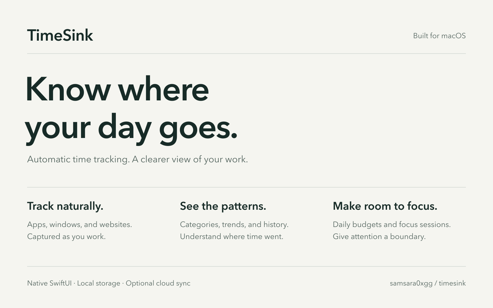

# TimeSink

[](https://github.com/samsara0xgg/timesink/actions/workflows/ci.yml)

**Know where your day goes.** A native macOS menu bar app that automatically tracks apps and websites, helps you understand your habits, and protects time for focused work.

[Download for macOS](https://d2e75eb005kjod.cloudfront.net/TimeSink.dmg) · [Coming soon](#coming-soon-automatic-categories-with-jev) · [Features](#from-activity-to-understanding) · [Engineering](#engineering-highlights) · [Privacy](#your-data-your-choice) · [Build from source](#build-from-source)

> ### Coming soon: automatic categories with Jev
>
> The next release hands most categorization to Jev, TypeSafe's decision model, called through OpenRouter. Each distinct activity (app, site, window title) is judged once and cached, and your own rules always take priority. If Jev isn't sure, it asks again with examples you've already confirmed. Anything still uncertain goes to a To confirm list instead of being guessed.
>
> - On 30 days of real usage, 98% of tracked time landed in the right category, up from 73% with the old rule-based classifier. This was measured on 262 activities that two independent labelers agreed on.
> - Classifying the full 30 days cost about $0.25. Ongoing use stays under a monthly cap you set (default $1).
> - It's optional, off by default, and uses your own OpenRouter key. It sends the app name, domain, window title and document name. Optionally, it also sends text read from screenshots, with emails and long numbers removed.



**macOS 14+ · Swift 6 · SwiftUI · SQLite (GRDB) · AWS Lambda · DynamoDB · CDK · GitHub Actions · English & Chinese**

## From activity to understanding

TimeSink lives in the menu bar and records the foreground app as you work. Open the dashboard to see where your time went, drill into the activity timeline, or start a focus session without maintaining a manual timesheet.

| What you can do | How TimeSink helps |
| --- | --- |
| **Track automatically** | Records active apps and window titles, reads the current Chrome tab URL, and detects idle time, sleep, and screen lock. |
| **Understand your day** | See app and category rankings, productivity scores, category breakdowns, period comparisons, a 30-day trend, and a weekday-by-hour heatmap. Choose daily, weekly, monthly, or custom ranges. |
| **Review the details** | Search your activity history, inspect the timeline, reclassify activities, and optionally overlay calendar events. |
| **Make categories yours** | Built-in app and domain rules, custom rules, and scoped title rules with an impact preview before applying them. |
| **Protect your attention** | Set daily category budgets and receive reminders. Start a timed focus session that hides selected apps and redirects blocked website categories in Chrome to a local blocking page. |
| **Recall the context** | Optional foreground-window captures and on-device OCR help you revisit what you were doing. Screenshot files expire after seven days. |
| **Sync when you choose** | Optional account-based cloud sync exchanges activity records across devices. Local tracking works without signing in. |

## Engineering highlights

```text
Foreground app + Chrome + system state          (sampled once a second)
                  ↓
          Activity spans → SQLite (GRDB)          (a new span when app, title, URL or document changes)
                  ↓                    ↘
       Rules and category resolution     Cloud sync: HTTP API → Python Lambda → DynamoDB (Cognito auth)
                  ↓
       Stats · Timeline · Budgets · Focus
```

- **Data capture.** The tracker samples the frontmost app once a second and starts a new span whenever the app, window title, URL or document changes. Spans are stored locally in SQLite through GRDB.
- **Categorization.** Every span resolves to a category through built-in app rules, URL rules, about 8,100 seeded domains and user rules. Results are cached by span content and URL rules are precompiled, so classifying 30 days of history does not block the UI.
- **Cloud sync.** One Python Lambda behind an HTTP API with a Cognito JWT authorizer ([`cloud/api`](cloud/api)). Items are keyed by user and `device#originId`, so a retried upload overwrites instead of duplicating. Devices pull each other's records through a time-ordered index, page by page, with a 60-second overlap so concurrent writers are never missed. Infrastructure is TypeScript CDK ([`cloud/infra`](cloud/infra)).
- **Tests and CI/CD.** Every push runs GitHub Actions: the Swift package builds and its test suite runs on macOS, the Lambda tests run against moto (mocked DynamoDB and Cognito), and assertion tests hold the CDK app to its guarantees (retained user data, every route behind auth, throttling, deploy trust limited to `main`) before it synthesizes. The API is rate-limited, Lambda logs expire after 30 days, and errors or 5xx responses raise an email alarm. Changes under `cloud/` that reach `main` deploy to AWS through GitHub OIDC, with no AWS keys stored anywhere.

### Measured performance

Release builds, measured against a read-only copy of a real database (deleted after use; only timings were kept).

| Path | Before | After | Data |
| --- | ---: | ---: | --- |
| Menu bar popover open, warm (first open after launch: 0.67 s) | 9.2 s | 0.11 s | 31,804 spans |
| Activities timeline render, one day | 1,199 ms | 60.5 ms | 3,280-span day |
| Timeline blocks drawn at default zoom | 3,267 | 32 | same day |
| Sidebar badge, 30-day classification on the main actor | 944 ms | 0.01 ms | 30 days |

Method and full findings: [optimization plan](docs/superpowers/plans/2026-09-07-timesink-optimization.md) and [audit](docs/audit-2026-09-29.md).

| Timeline before | Timeline after |
| --- | --- |
|  |  |

Screenshots are rendered from a synthetic fixture (`TimeSink --design-preview`) and contain no real activity data.

## Install

1. [Download TimeSink.dmg](https://d2e75eb005kjod.cloudfront.net/TimeSink.dmg). This is the last published build; `main` is newer, so [build from source](#build-from-source) for the latest changes.
2. Drag **TimeSink** into **Applications**, then open it.
3. Grant Accessibility access to start tracking. Enable the other permissions only for the features you use.

Updates are delivered through Sparkle. You can check manually in **Settings → General → Check for Updates…**.

## Your data, your choice

Activity is stored in a local SQLite database. **Cloud sync and AI classification are optional and off by default.**

| Feature | Data handling |
| --- | --- |
| **Local tracking** | Stores activity timestamps, app identity, window titles, and available URL, domain, and document information locally. No account is required. |
| **Cloud sync — optional** | When enabled after sign-in, uploads completed activity records, including their titles, URLs, domains, and document fields, to the TimeSink cloud service. Downloads records from your other devices. |
| **AI classification — optional** | Sends an unclassified website's domain and available page title to the OpenAI-compatible endpoint you configure. Requires your own provider configuration and API key. |
| **Screen capture — optional** | Captures the foreground window and runs OCR locally. Images and OCR observations are not part of activity-record cloud sync. Images are retained for seven days; OCR text remains in the local database. Password managers and Keychain Access are excluded; capture pauses while locked, asleep, or manually paused. |
| **Updates** | Contacts the release service to check for and download app updates. |

### macOS permissions

- **Accessibility:** foreground app and window-title tracking.
- **Automation for Chrome:** current-tab URL detection and website blocking during focus sessions.
- **Calendar — optional:** event overlays, meeting detection, and meeting-aware idle handling.
- **Screen Recording — optional:** foreground-window capture for local OCR and recall.
- **Notifications — optional:** budget warnings, daily summaries, and focus-session reminders.

### Storage and backups

```text
~/Library/Application Support/TimeSink/timesink.sqlite
```

Quit TimeSink before copying the database for a consistent backup. A database backup does not include screenshot image files. Removing the app does not automatically remove its Application Support directory.

## Build from source

Requires macOS 14 or later and a Swift 6 toolchain. Swift Package Manager resolves [GRDB.swift](https://github.com/groue/GRDB.swift) and [Sparkle](https://github.com/sparkle-project/Sparkle).

```bash
git clone https://github.com/samsara0xgg/timesink.git
cd timesink
swift build
swift test
swift run TimeSink
```

`swift run` uses a separate `timesink-dev.sqlite` database, so development does not duplicate tracking in your installed app's database. Accessibility and Automation permissions belong to the terminal hosting the development process. Calendar and notification permissions need the signed app bundle installed in `/Applications` to work correctly.

To install your own signed build:

```bash
bash scripts/make_cert.sh
# In Keychain Access, set the TimeSink Dev certificate's Code Signing trust
# to Always Trust before installing.
make install CERT="TimeSink Dev"
```

`make install` defaults to the maintainer's Developer ID certificate; override `CERT` for your own build. Changing the signing identity requires granting macOS permissions again. Local builds are not notarized. See [Releasing TimeSink](docs/RELEASING.md) for the distribution process.

The macOS app uses SwiftUI, AppKit, Accessibility, EventKit, ScreenCaptureKit, and Vision. The optional cloud backend lives in [`cloud/`](cloud/), using Python, AWS Lambda, DynamoDB, Cognito, and TypeScript CDK infrastructure.

Useful development checks:

```bash
swift test
python3 scripts/check_strings.py
swift run tsprobe  # Prints foreground-window, Chrome, and idle diagnostics
(cd cloud/api && python -m pytest -q)
```

## Acknowledgments

- The Stats overview layout was inspired by [Timing](https://timingapp.com).
- Website classification seed data comes from [WhoTracks.me](https://github.com/whotracksme/whotracks.me) (MIT License).

Built by [Yilun (Allen) Shi](https://github.com/samsara0xgg), builder of [Jarvis](https://github.com/samsara0xgg/Jarvis).
