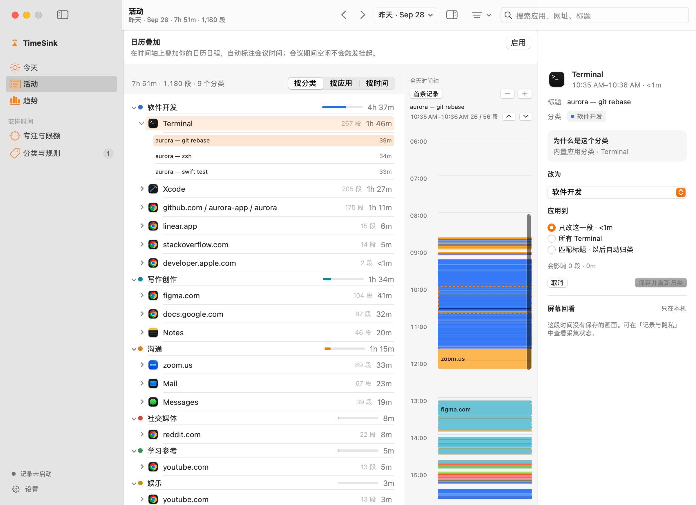
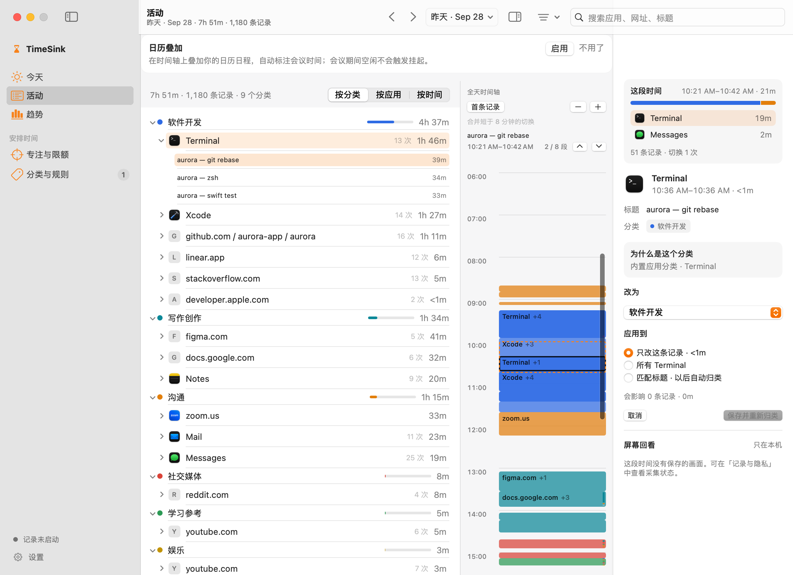
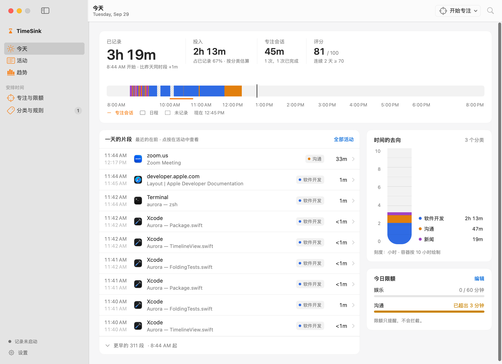
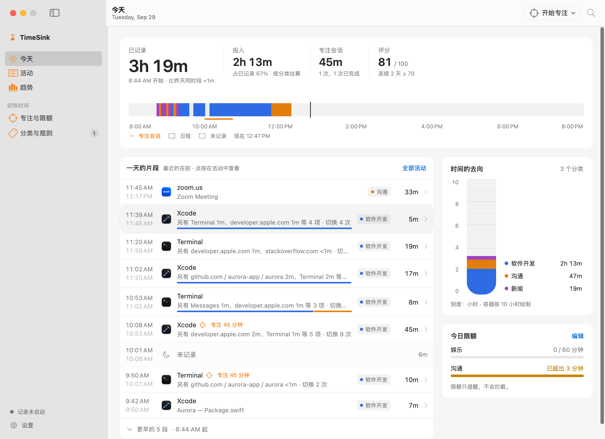

# TimeSink audit and v1 refinements (2026-09-29)

This branch (`v1-refined-plus`) keeps the refined interface and fixes what an
end-to-end audit found: the day timeline that drew one mark per record, main
thread stalls, and functional gaps across the popover, rules, settings and
onboarding. The unconstrained redesign lives on `v2-1440`; see
`docs/1440-design-2026-09-29.md` there.

## Method

- Read every surface: menu bar popover, Today, Activities and the inspector,
  Stats, Focus, Organization (uncategorized, rules, categories), Settings and
  onboarding. For each data refresh, traced what runs on the main actor.
- Profiled the hot paths in release builds against a read-only copy of a real
  database, deleted after use; only timings were kept
  (`TIMESINK_PERF_DB`, `TimelinePerformanceTests`, `StatsPerformanceTests`).
- Rendered every surface from the synthetic fixture
  (`TimeSink --design-preview`). No screenshot contains real activity data.

## The timeline

The tracker samples the frontmost app once a second and starts a new record
whenever the app, window title, URL or document changes. That is right for
statistics: a real day holds 1,400 to 3,300 records, about 95% of them shorter
than a minute.

The day timeline drew one block per record and merged neighbours only when
their titles matched exactly and one ended at the very instant the next began.
On a 3,279-record day that merged 12 records. At the default zoom 98.6% of the
blocks were below the 2 pt minimum height, none was tall enough for a label,
and the render took 1.2 s. The Today ribbon and piece list had the same shape.
The lag and the visual noise had one cause: the drawing resolution was far
finer than the screen or the eye can resolve.

`TimelineSegmenter` (commit d7fdc12) folds spans into segments no shorter than
the smallest legible mark at the current scale. Gaps under 30 s are bridged,
titles no longer split a run, and every recorded second stays in the
segment's parts. The timeline refolds at nine zoom stops, keeps a dimmed base
plus a highlight layer when filtered, and a mixed block opens its composition
in the inspector.

| Before | v1 |
| --- | --- |
|  |  |
|  |  |

## Measurements

Release build, one read-only copy of a real database, the same 3,280-record day
before and after.

| Path | Before | v1 |
| --- | ---: | ---: |
| Timeline blocks at the default zoom | 3,267 | 32 |
| Activities timeline render | 1,199 ms | 60.5 ms |
| Today ribbon render, compact | 611 ms | 29.3 ms |
| Today ribbon render, full width | 650 ms | 38.5 ms |
| Menu bar popover render | 326 ms | 217 ms |
| Sidebar badge, 30-day classify on the main actor | 944 ms | 0.01 ms |
| Main-actor work per data change | not measured | 2.2 ms |

## Findings

41 findings: 3 P0, 10 P1, 16 P2, 12 P3. v1 fixes 40 and partly fixes one.

| Sev | Area | Finding | v1 |
| --- | --- | --- | --- |
| P0 | Timeline | One block per record: 3,267 blocks, 1.2 s render, stripes. | Folded to the legible resolution of each zoom stop. |
| P0 | Inspector | Outside "this segment only", every render classified 30 days cold three times (about 2.5 s). | Preview computed once per input, off the render path, over the spans the rule can reach. |
| P0 | Inspector | With a record selected, every tracker write refetched 30 days on the main actor. | Re-read only after a user edit; one load per selection. |
| P1 | Cache | Every write, heartbeats included, cleared every range window. | Only windows that include today are dropped. |
| P1 | Uncategorized | The default sub-tab fetched and classified 30 days on the main actor per refresh. | Recomputed on appear and on classification edits. |
| P1 | Sidebar | The pending badge classified 30 days inside a view body and never updated. | Observable count, refreshed off the main actor. |
| P1 | Popover | A bare Space started a focus session, hiding apps and blocking sites. | Shortcut removed. |
| P1 | Uncategorized | Chrome pages without a domain could not be categorized; the badge never cleared. | Pages without a website follow the app's category. |
| P1 | Rules | URL rules were split on commas into patterns that never match. | URL rules are not split. |
| P1 | Smart categories | Endpoint and model edits were lost on tab switch; Return in the empty key field erased the stored key. | Values persist as typed; empty saves are ignored; the test says when it used an unsaved key. |
| P1 | Notifications | Budgets and the daily summary never asked for permission, so alerts were dropped. | Permission requested when either is enabled. |
| P1 | Onboarding | The Chrome step did nothing while Chrome was closed and explained nothing. | Every state is explained with its action. |
| P1 | Onboarding | Copy said screen capture was opt-in, but it was on and prompted mid-onboarding. | Waits for the user's opt-in on first run. |
| P2 | Today | Today ran a second full dashboard recompute, again every 30 s. | The 30 s loop moves the ribbon only; numbers recompute on data or at midnight. |
| P2 | Activities | By-app and by-time groupings sorted every record in the body; each row built two date formatters. | Folded rows; cached formatter. |
| P2 | Inspector | Thumbnails decoded 1920×1080 JPEGs on the main actor for 50 pt cells. | Thumbnail decode off the main actor. |
| P2 | Settings | Budgets, blocked apps and the shortcut invalidated the 30-day stats and streak. | These edits refresh views from the caches. |
| P2 | Popover | The gear opened Settings possibly behind the frontmost app. | Same route as the other entries, brought forward. |
| P2 | English | Fixed columns clipped English names ("Software Development" is 143 pt in a 94 pt column). | Columns sized to the widest name. |
| P2 | Uncategorized | Main-actor recompute after each assignment; a DB error showed the all-clear state; the picker offered Uncategorized. | The pane's own assignments update rows in place and accept-all publishes once; a load error has its own state; Uncategorized is gone from the picker. |
| P2 | Rules | Each change loaded twice; hit counts never updated while tracking. | Compiled hit counting, live counts. |
| P2 | Rules | Drag to reorder had no keyboard path and failed silently across scopes. | Keyboard moves; an error across scopes. |
| P2 | Rules | Site and app overrides could not be removed and left the key unmapped when disabled. | Deleting restores the shipped mapping. |
| P2 | Rules | New title rules got different priorities depending on the entry point. | New rules rank first in their scope. |
| P2 | Rules | The title editor hid an invalid prefill and overloaded Return. | Invalid prefill shown as editable text with the reason; Return is unambiguous. |
| P2 | Categories | A half-typed rename left the resolver's categories stale; empty names were saved. | Published on disappear; empty names rejected. |
| P2 | Stats | Heatmap labels ignored the 12/24-hour setting. | Labels follow the reader's clock (v2 replaces the heatmap). |
| P2 | Permissions | Never-requested optional permissions showed as a red "not granted". | Neutral "not requested yet". |
| P2 | Focus | The blocked-apps picker scanned three Applications folders on the main actor. | Scanned in a detached task. |
| P3 | Settings | Synchronous SQLite reads inside view bodies. | `SettingsStore.get` serves from memory after the first read. |
| P3 | Tracker | 3 to 6 settings reads per second on the main actor. | Same cache. |
| P3 | Parsing | URLs were parsed before checking for GitHub, GitLab or YouTube. | Domain checked first. |
| P3 | Midnight | Today's events, open ranges and the menu label stayed on yesterday. | Ranges anchored on today or yesterday roll forward; calendar changes refetch. |
| P3 | Window | The subtitle did not follow data changes. | Read on page or data change. |
| P3 | DST | "Same time yesterday" was an hour off on DST days. | Uses yesterday's same wall-clock time. |
| P3 | Undo | For 6 s after a reclassification, Cmd-Z undid it instead of text edits. | Category undo goes through the window's undo stack. |
| P3 | Shortcut | A failed hotkey registration retried on every menu label render. | The failed combination is remembered. |
| P3 | Code | Unreachable panes, cards and the popover focus config view. | Removed. |
| P3 | Localization | No plural forms; rules showed "a\|b" and raw bundle IDs; raw error descriptions. | Complete English catalog with plurals; readable rule rows and errors. |
| P3 | Accessibility | Per-row controls shared one VoiceOver label. | Partly: rule and category rows carry their names; uncategorized rows and budget toggles still use generic labels. |
| P3 | Details | Rule errors leaked into the URL sheet; edited colours could not return to the adaptive palette; the account pane showed 0 uploads after relaunch. | The URL sheet has its own error, cleared on cancel; a context-menu reset restores the default colour; the account pane no longer shows 0 uploads after a relaunch. |

## Residuals

- Accessibility labels on uncategorized rows and budget toggles are still
  generic.
- `ColorHex.toHex()` still omits the leading `#`, so picking the default colour
  by hand does not restore the adaptive palette; the reset does.
- If `InstallEventHandler` itself fails, the popover shortcut still retries on
  every render; a failed `RegisterEventHotKey` no longer does.
